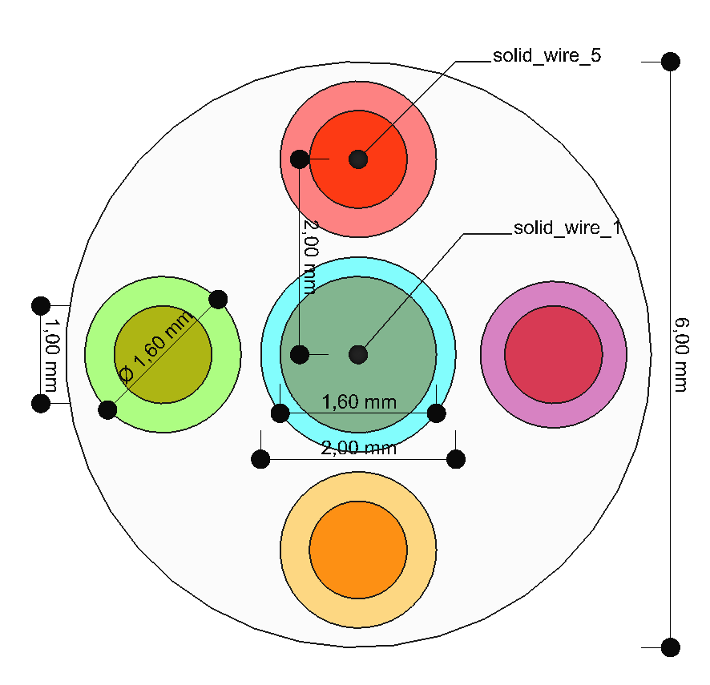
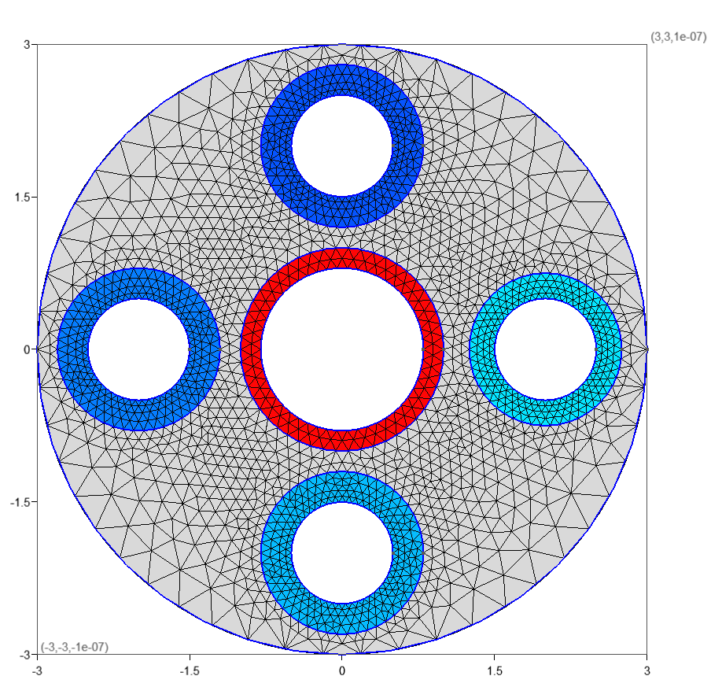

# step2gmsh

[](https://github.com/lmdiazangulo/step2gmsh/actions/workflows/tests.yml)

`step2gmsh` is a collection of python scripts to generate [MFEM](https://mfem.org/) compatible meshes from step files using calls to [gmsh mesher](https://gmsh.info/).

The main usage is to generate 2D finite element method (FEM) meshes which can be used to solve electrostatic/magnetostatic problems.

## Installation

Install requirements with

```shell
    python -m pip install -r requirements.txt
```

## Usage

Launch from command line as

```shell
    python src/step2gmsh.py <-i path_to_step_file>
```

The tested input step files have been generated with [FreeCAD](https://www.freecad.org/). The geometrical entities within the step file must be separated in layers. The operations which are performed of the different layers depend on their name.

- A layer named `Conductor_N` with `N` being an integer represents a perfect conductor. `Conductor_0` is a special case of which represents the ground and defines the global domain. For layers named `Conductor_N` with `N` different to zero their areas will be substracted from the computational domain and removed.
- Layers named as `Dielectric_N` are used to identify regions which will have a material assigned.
- Open and semi-open problems can be defined using a single layer called `OpenBoundary`.

Below is shown an example of a closed case with 6 conductors and 5 dielectrics, the external boundary corresponds to `Conductor_0`. The case is modeled with FreeCAD and can be found in the `testData/five_wires` folder together with the exported as a step file. The resulting mesh after applying `step2gmsh` is shown below.




## License and copyright

``` step2gmsh ``` is licensed under [GNU GENERAL PUBLIC LICENSE Version 2](LICENSE), its copyright belongs to the University of Granada.

## Acknowledgments

This project is funded by the following grants:

- HECATE - Hybrid ElectriC regional Aircraft distribution TEchnologies. HE-HORIZON-JU-Clean-Aviation-2022-01. European Union.
- ESAMA - Métodos numéricos avanzados para el análisis de materiales eléctricos y magnéticos en aplicaciones aerospaciales. PID2022-137495OB-C31. Spain.